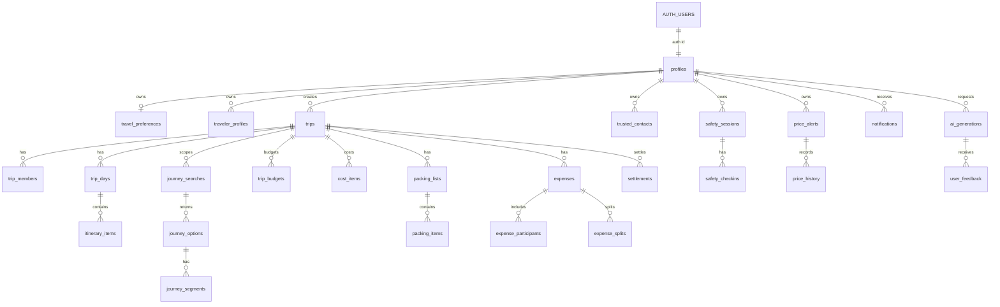

# TravelAI Database

TravelAI uses Supabase Postgres with Supabase Auth as the source of identity. Public user records live in `profiles`, keyed by the same UUID as `auth.users.id`.

Money is stored consistently as integer minor units. For INR, `4000000` means Rs 40,000.00. Absolute date-times use `timestamptz`; trip calendar days use `date` plus the trip's IANA `timezone`.

## Migrations

Schema:

```bash
cd backend/supabase
supabase db reset
```

Apply to a linked project:

```bash
cd backend/supabase
supabase link --project-ref <project-ref>
supabase db push
```

The seed file is `backend/supabase/seed.sql`. `supabase db reset` loads it automatically after migrations.

Run only the seed against a local database:

```bash
cd backend/supabase
supabase db seed
```

## TypeScript Types

Generate database types from the local Supabase stack:

```bash
cd backend/supabase
supabase gen types typescript --local > ../../frontend/src/types/supabase.ts
```

Generate types from a hosted project:

```bash
cd backend/supabase
supabase gen types typescript --project-id <project-ref> > ../../frontend/src/types/supabase.ts
```

Do not put service-role keys in frontend code. Frontend code should use the anon key and rely on Row Level Security. Service-role keys belong only in trusted server environments such as Supabase Edge Functions or private backend jobs.

## Tables

### Identity

`profiles`
: Public profile for each Supabase Auth user. Created automatically by `public.handle_new_user()` after insert on `auth.users`. Stores onboarding fields such as full name, phone, optional date of birth, home city, avatar URL, currency, and language.

`travel_preferences`
: One row per user for budget style, transport modes, comfort level, travel pace, interests, food preferences, accessibility needs, safety preference, and optional daily budget.

`traveler_profiles`
: Reusable traveler records owned by a user. These can link to another authenticated profile or represent a companion without an account.

### Trips

`trips`
: Core trip record with creator, origin, destination, local date range, timezone, status, currency, and total budget.

`trip_members`
: Membership table used for trip-level access. Members can be authenticated users, traveler profiles, or invited emails. Roles are `owner`, `organizer`, `traveler`, and `viewer`; statuses are `invited`, `accepted`, `declined`, and `removed`.

`trip_days`
: One local calendar day per trip day.

`itinerary_items`
: Scheduled or unscheduled trip items such as transport, stays, food, and activities. Uses `timestamptz` for exact scheduled times and `time` for floating local times.

### Journey Search

`journey_searches`
: A user's route search for flights, trains, buses, cabs, ferries, or mixed transport.

`journey_options`
: Returned journey choices with provider data, total price in minor units, status, booking URL, and recommendation metadata.

`journey_segments`
: Segment-level legs for a journey option.

### Budget And Costs

`trip_budgets`
: Planned and actual budget buckets per trip category.

`cost_items`
: Estimated, manual, booking, or expense-linked costs.

### Packing

`packing_lists`
: Trip packing lists, optionally scoped to one user.

`packing_items`
: Packing checklist items with category, quantity, assignment, packed status, and source.

### Expenses

`expenses`
: Shared trip expenses with payer, amount, category, timestamp, receipt URL, and creator.

`expense_participants`
: Members included in an expense.

`expense_splits`
: Amount owed by each member for an expense.

`settlements`
: Payments between members to settle balances.

### Safety

`trusted_contacts`
: User-owned emergency contacts.

`safety_sessions`
: User-owned check-in sessions, optionally linked to a trip.

`safety_checkins`
: Scheduled, completed, missed, or escalated check-ins for a safety session.

### Prices And Notifications

`price_alerts`
: User-owned price watches. `status` and `next_check_at` are indexed for alert-processing jobs.

`price_history`
: Observed prices for alerts or journey options.

`notifications`
: User-owned notification log with read/archive state.

### AI And Feedback

`ai_generations`
: Audit trail for AI features such as itinerary, journey, packing, budget, and safety generation.

`user_feedback`
: Ratings and feedback tied to users, trips, and optional AI generation rows.

## Relationships



## Important Policies

RLS is enabled on every public table.

Helper functions:

`public.is_trip_member(trip_id, user_id default auth.uid())`
: Returns true when the user created the trip or has an accepted `trip_members` row.

`public.is_trip_organizer(trip_id, user_id default auth.uid())`
: Returns true when the user created the trip or has accepted `owner` or `organizer` membership.

Policy summary:

- Profiles, preferences, traveler profiles, trusted contacts, safety sessions, price alerts, notifications, AI generations, and feedback are scoped to the owning `user_id`.
- Trips can be selected by creators and accepted members. Trip updates are limited to creators and organizers. Trip deletes are limited to creators.
- Trip child tables such as `trip_days`, `itinerary_items`, budgets, costs, packing, expenses, and settlements are scoped through `is_trip_member(trip_id)`.
- Journey options and segments are visible through either their trip membership or the user who created the search.
- Price history is readable through the owning price alert or a visible journey option. Inserts are intentionally left to trusted backend jobs.
- Safety check-ins are scoped to the owning user through `user_id`.

## Seed Data

The demo seed creates four local auth users:

- `ananya.demo@travelai.local`
- `rohan.demo@travelai.local`
- `meera.demo@travelai.local`
- `kabir.demo@travelai.local`

All demo users use the local development password `TravelAI123!`.

The seed trip is `Hyderabad to Goa friends trip`, scheduled for `2026-08-14` through `2026-08-17`, with four travelers and a total budget of `4000000` minor units, equal to Rs 40,000.00.
